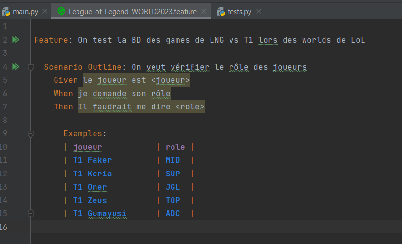
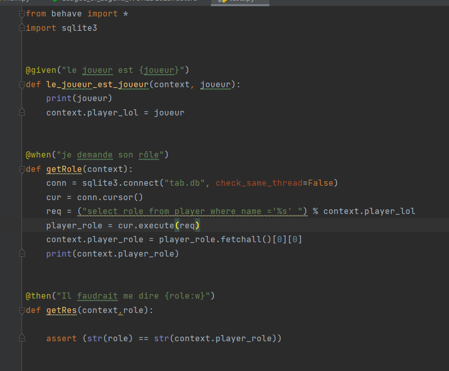
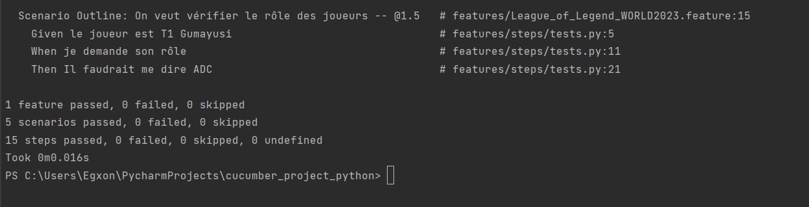

= R5.A.08 -- Dépôt pour les TPs
:icons: font
:MoSCoW: https://fr.wikipedia.org/wiki/M%C3%A9thode_MoSCoW[MoSCoW]

Ce dépôt concerne les rendus de mailto:A_changer@etu.univ-tlse2.fr[Jonh Doe].

== TP1

.Exemple de code
[source,java]
---
@Given("today is Sunday")
public void today_is_sunday() {
    // Write code here that turns the phrase above into concrete actions
    throw new io.cucumber.java.PendingException();
}
---

.Exemple d'image insérée en asciidoc
image::artifacts-r303.svg[width=80%]

Voici le contenue de mon fichier : is_it_friday_yet.feature :

    #language: fr
    Fonctionnalité: : C'est déjà ?
    je veux vraiment savoir si aujourd'hui c'est vendredi

  Plan du scénario: Aujourd'hui c'est vendredi ?
    Etant donné Aujourd'hui c'est "<jour>"
    Quand Je demande c'est quand Vendredi
    Alors Il faudrait me dire "<reponse>"

    Exemples:
      | jour           | reponse |
      | Friday         | TGIF    |
      | Sunday         | Non     |
      | anything else! | Non     |

== TP2...

Voici le contenu de ma classe order :

    package dojo;
    import java.util.ArrayList;
    import java.util.List;

    public class Order {

    private String owner ;
    private List<String> cocktails;
    private String target;
    private String msg;

    public Order() {
        this.owner = null;
        this.cocktails = new ArrayList<String>();
        this.target = null;
    }

    public void declareOwner(String nom) {
        this.owner = nom;
    }

    public String getOwner() {
        return this.owner;
    }

    public void declareTarget(String nom) {
        this.target = nom;
    }

    public String getTarget() {
        return this.target;
    }

    public List<String> getCocktails() {
        return this.cocktails;
    }

    public void declareMsg(String msg) {
        this.msg = msg;
    }

    public String getMsg(){
        return this.msg;
    }

    }

== TP3

J'ai décidé de faire le TP3 sur python, en important une BD que j'ai crée
qui comporte des données sur des matchs E-Sport des championnats du monde
de League of Legend (Quart de final : LNG vs T1)

Voici mon fichier feature :

Voici mon fichier Python de test

Et enfin voici les résultats :

Explication :

Pour ce TP, j'ai décidé d'essayer cucumber sur python pour
voir comment ça marche avec Bahave.
De plus j'ai repris une base de donnée d'un projet personnel
pour relier conaissance des projets pro + conaissance de l'iut.
Donc mon ojectif était de tester ma BD avec cucumber (behave sur python).

J'ai eu des difficulté sur le choix du language, c'est à dire que ma feature
est écrit en français alors que j'ai pas indiqué le language avec #langage: fr.
Néanmoin les test sont bien passé et tout marche bien.